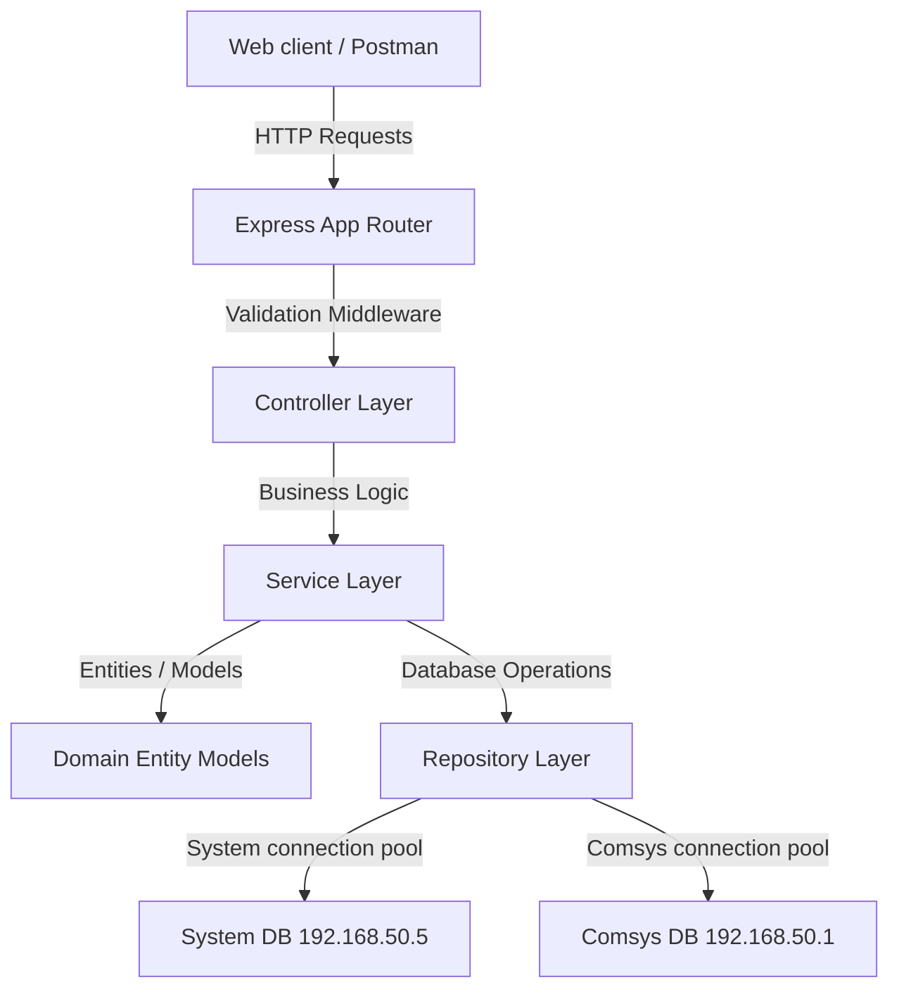

# Backend Architecture & Coding Guidelines — Inventory Tracking System

This document outlines the software engineering principles, system design patterns, and coding standards adopted in the operational inventory tracking backend. We adhere to **SOLID principles**, strict **Clean Architecture**, and robust **System Design** standards suited for senior Node.js engineering.

---

## 1. System Architecture Overview

The system is designed as a custom operational tracking layer built on top of a read-only Comsys ERP.



### Key Architectural Constraints:
1. **Comsys ERP DB** (`FHtlPTrain` @ `192.168.50.1`): **Strictly READ-ONLY**. No write operations must ever hit Comsys tables (`dbo` schema).
2. **System Database** (`InventoryOps` @ `192.168.50.5`): **Writeable**. Stores system users, custom tree hierarchy nodes, operational stocks, and custom transfers. Uses the `ops` schema.

---

## 2. Layered Responsibilities (Clean Architecture)

We strictly separate concerns by dividing the codebase into four isolated layers:

| Layer | Responsibility | File Suffix | Constraints |
|---|---|---|---|
| **Routing** | Maps HTTP endpoints to controllers, registers RBAC filters, and applies route validations. | `.routes.js` | No business logic. No database calls. |
| **Controller** | Extracts request parameters, triggers services, and formats standard API JSON outputs. | `.controller.js` | Uses `asyncHandler` for safe error propagation. |
| **Service** | Implements domain business rules, manages transactional state, and triggers repositories. | `.service.js` | No direct HTTP req/res objects. No SQL code. |
| **Repository** | Performs raw database queries, maps inputs to SQL parameters, and instantiates Model classes. | `.repo.js` | Never writes logic. Always returns Model entities. |
| **Model / Entity** | Encapsulates business data, maps database columns, and enforces domain rules. | `.model.js` | No database or external service imports. |

---

## 3. SOLID Principles in Practice

### Single Responsibility Principle (SRP)
Each module must do exactly one thing. For example, `comsysWarehouses.repo.js` is only responsible for querying warehouse codes from Comsys. Caching and synchronizing them into our database is delegated to `comsysSync.repo.js` and `sync.service.js`.

### Open/Closed Principle (OCP)
The sync service is designed to be open for extension but closed for modification. For instance, the repository helper `getAllWarehouses(prefix)` and `getAllItems(prefix)` take a department prefix (`'fb'` or `'gs'`). Adding a new Comsys department (e.g. `'es'` for Engineering) requires only passing the new prefix parameter, not modifying the internal SQL queries.

### Liskov Substitution Principle (LSP)
Our repository methods return instances of Domain Model classes (e.g., `User` or `TransferTransaction`) instead of raw database query results. Any part of the application receiving these objects can safely interact with standard methods (`toJSON()`, `isDraft()`) without breaking.

### Interface Segregation Principle (ISP)
Since JS does not have compiler interfaces, we enforce this by segregating our repository classes. Rather than having a single massive database class, we split them into domain-specific modules (`user.repo.js`, `stock.repo.js`, `transfer.repo.js`).

### Dependency Inversion Principle (DIP)
High-level business services must not depend on low-level database connection pools directly. Services import repositories, and repositories fetch the connection pool from the database config dynamically (`getSystemDB()` / `getComsysDB()`).

---

## 4. Coding Standards & Guidelines

### 4.1 Strict Mode & Modern JavaScript
Always enable strict mode at the top of every file:
```javascript
'use strict';
```
Use `const` for unchanging variables, `let` only for variables that will be reassigned. Avoid `var` entirely.

### 4.2 Error Handling & Custom Exceptions
Never catch errors without rethrowing or passing them to the Express error boundary. Use custom classes derived from `AppError` to automate HTTP statuses and localized messages:
```javascript
// src/utils/errors.js
class AppError extends Error {
  constructor(message, statusCode, code = 'INTERNAL_ERROR') {
    super(message);
    this.statusCode = statusCode;
    this.code = code;
  }
}
```
Use `asyncHandler` in controllers so asynchronous errors are caught and forwarded to the global error middleware automatically.

### 4.3 Parameterized Queries & Security
**Zero Tolerance for SQL Injection**. Never concatenate strings to form SQL statements. Always use SQL parameterization:
```javascript
// CORRECT
const result = await pool.request()
  .input('nodeId', sql.Int, nodeId)
  .query('SELECT * FROM ops.inventory_nodes WHERE node_id = @nodeId');
```

---

## 5. System Design Patterns

### 5.1 Isolated Connection Pools
To prevent cross-talk and connection pool collisions:
- `src/config/database.js` manages the `getSystemDB()` connection pool.
- `src/config/comsys.database.js` manages the `getComsysDB()` connection pool.
Both export independent instances of `new sql.ConnectionPool()` initialized with separate server and database configurations.

### 5.2 Atomic Database Transactions
Operational stock updates must be atomic. When confirming an internal transfer:
1. Deduct stock from the source node (`qty_transferred_out` increment).
2. Add stock to the destination node (`qty_internal_in` increment).
3. Update transaction status to `'confirmed'`.
All three steps must execute inside a single SQL transaction. If any step fails, the entire transaction rolls back:
```javascript
const transaction = new sql.Transaction(pool);
try {
  await transaction.begin();
  // ... execute queries passing transaction connection ...
  await transaction.commit();
} catch (err) {
  await transaction.rollback();
  throw err;
}
```

### 5.3 Route Validation Layer
All routes that receive user input (`body`, `query`, or `params`) must validate the request schema using `Joi` middleware *before* invoking controllers:
```javascript
// src/api/v1/users/user.routes.js
const validate = require('../../../middleware/validate.middleware');
const { createUserSchema } = require('./user.validation');

router.post('/', authenticate, validate(createUserSchema), controller.createUser);
```
This sanitizes the input, strips unknown fields, coerces types, and halts bad requests early at the routing boundary with a `400 Bad Request`.

---

## 6. Role & Authorization Contract

The system operates on a **6-level role hierarchy**. Higher level = broader permissions. All roles are stored in `ops.app_users.role` and embedded in the JWT payload (`decoded.role`).

### Role Definitions

| Level | Role Constant | Arabic Label | Scope & Permitted Actions |
|---|---|---|---|
| 5 | `admin` | مدير النظام | Full system — user CRUD, sync, all nodes, configuration |
| 4 | `manager` | مدير عام | All nodes read + financial reports + transaction approvals |
| 3 | `warehouse_manager` | مدير مستودع | Assigned node + sub-nodes — create & confirm transactions |
| 2 | `warehouse_head` | رئيس عهدة | Own assigned node — create draft transactions, quick consume |
| 1 | `accountant` | محاسب | Read-only access to stock & financial reports — no write ops |
| 0 | `staff` | موظف مستودع | Own assigned node — quick consume only |

> **WAREHOUSE_ROLES** = `['warehouse_manager', 'warehouse_head', 'staff']`
> These roles must always have a `node_id` assigned. The `authorizeWarehouseScope` middleware enforces this.

### RBAC Middleware Usage

```javascript
const { authenticate }              = require('../middleware/auth.middleware');
const { authorize, authorizeMinLevel, authorizeOwnNode, authorizeWarehouseScope } = require('../middleware/rbac.middleware');

// Allow only admin
router.post('/sync', authenticate, authorize('admin'), syncController.run);

// Allow manager and above
router.get('/reports', authenticate, authorizeMinLevel('manager'), reportController.get);

// Allow anyone at warehouse_head level or above
router.get('/stock', authenticate, authorizeMinLevel('warehouse_head'), stockController.get);

// Allow only users operating on their own assigned node
router.post('/transactions', authenticate, authorizeMinLevel('warehouse_head'), authorizeWarehouseScope, txnController.create);

// Admin-only user management
router.post('/users', authenticate, authorize('admin'), validate(createUserSchema), userController.createUser);
router.patch('/users/:id/reset-password', authenticate, authorize('admin'), validate(resetPasswordSchema), userController.resetPassword);
```

### Permission Matrix

| Action | admin | manager | warehouse_manager | warehouse_head | accountant | staff |
|---|:---:|:---:|:---:|:---:|:---:|:---:|
| Create / Edit Users | ✅ | ❌ | ❌ | ❌ | ❌ | ❌ |
| Reset User Password | ✅ | ❌ | ❌ | ❌ | ❌ | ❌ |
| View User List | ✅ | ✅ | ❌ | ❌ | ❌ | ❌ |
| Sync Comsys Data | ✅ | ❌ | ❌ | ❌ | ❌ | ❌ |
| View All Nodes Stock | ✅ | ✅ | own node | own node | ✅ read | own node |
| Approve / Confirm Txn | ✅ | ✅ | ✅ | ❌ | ❌ | ❌ |
| Create Draft Txn | ✅ | ✅ | ✅ | ✅ | ❌ | ❌ |
| Quick Consume | ✅ | ✅ | ✅ | ✅ | ❌ | ✅ |
| Financial Reports | ✅ | ✅ | ✅ | ❌ | ✅ | ❌ |
